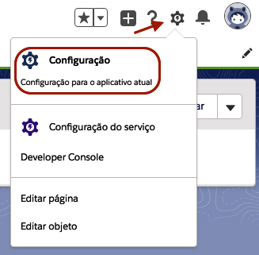
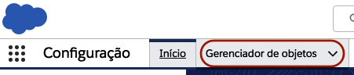
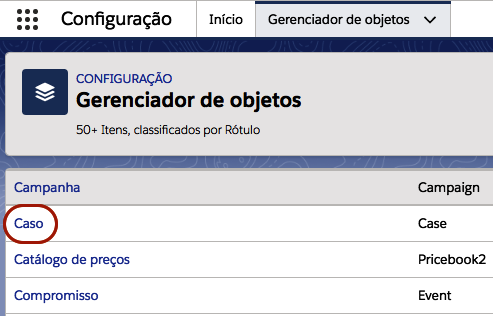
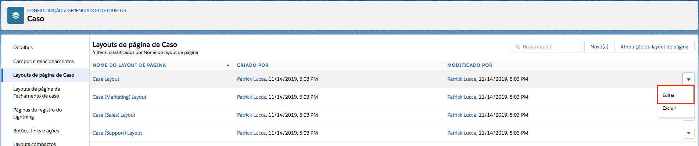
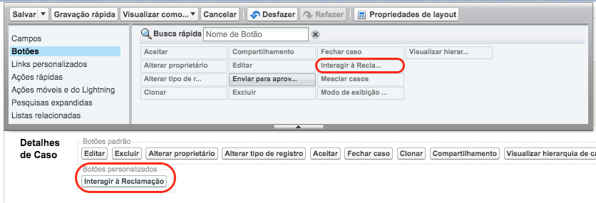
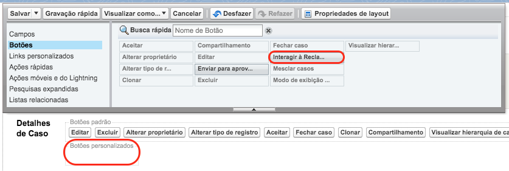
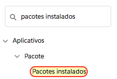
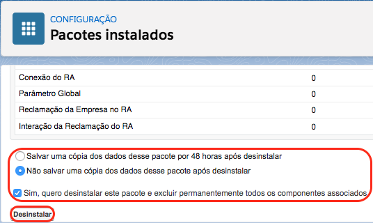

#############
Desinstalação
#############

É possível desinstalar o aplicativo do RA Connect da sua organização, mas para isso é necessário a remoção manual da dependência do pacote. 
Para isso será necessário retirar o **botão personalizado "Interagir à Reclamação"** dos Layouts de Página do objeto **CASO**, a seguir será
demonstrado como remover caso tenha inserido no **Case Layout**.   

Para isso vá até às configurações através da engrenagem no canto superior direito, como na figura a seguir:

    
    Acessando **Configurações** da organização.

Após isso, acesse o **Gerenciador de Objetos**, como na figura a seguir:

    
    Acessando o **Gerenciador de Objetos** na configuração da organização.

Agora busque e clique no objeto **Caso**, como na figura a seguir:

    
    Acessando o objeto **Caso** no gerenciador de objetos.

Agora, vá até o layout de página de Caso e clique em editar no layout onde irá remover o botão. Na figura a seguir será removido no **Case Layout**.

    
    Layouts de página de Caso

Na página de edição de layout, clique em **Botões**, nesse momento verá que tem um botão chamado **Interagir à reclamação** desabilitado, ele estará no campo de **Botões personalizados**, como é demonstrado nas figuras a seguir.

    
    Botão personalizado **Interagir à reclamação** no campo de **Botões personalizados**

Arraste ele até a área onde ficam os botões (nesse momento o botão **Interagir à reclamação** ficará habilitado, indicando que ele não é mais usado no layout).

    
    Botão removido no layout
 
Depois da remoção da dependência, a desinstalação pode ser realizada através dos **Pacotes Instalados**. 

Para isso vá até às configurações através da engrenagem no canto superior direito, como na figura a seguir:

    
    Acessando **Configurações** da organização.

A seguir digite na barra de busca rápida **Pacotes Instalados** e clique nele, como na figura a seguir:

    
    Barra de pesquisa das configurações

Nesta página terá os todos pacotes instalados na organização, nesse momento procure pelo pacote nomeado **RA Connect** e em seguida clique em **Desinstalar**, como na figura a seguir:

    
    Pacote RA Connect na página de pacotes instalados

Agora nesta página estará listado tudo que está sendo removido ao desinstalar o pacote. Ao final da página terá algumas opções adicionais que a pessoa pode marcar, como na figura a seguir:

