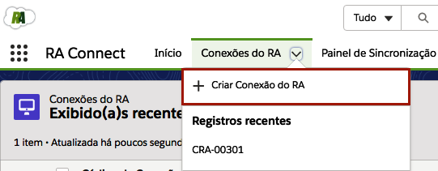
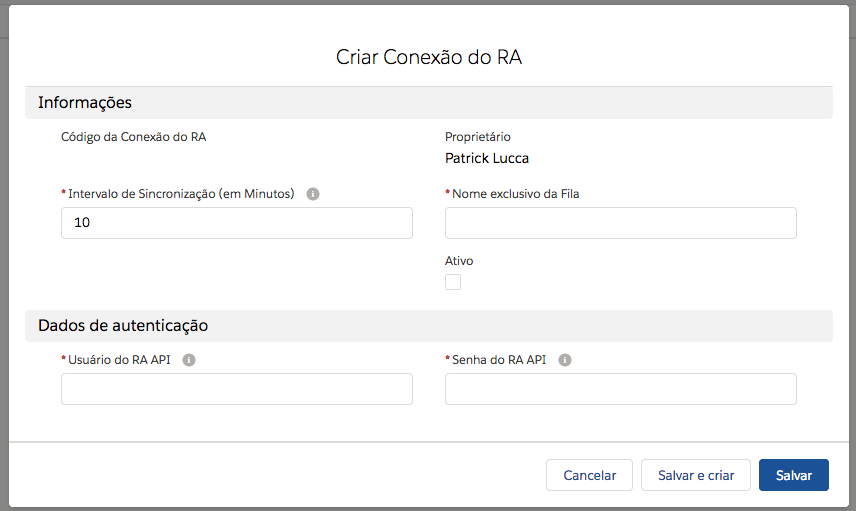

#################
Cadastro de Nova Conexão
#################

Para registrar uma nova conexão, vá na aba do **Conexões do RA** e clique em novo ou clique na aba e clique em Criar Conexão do RA, como na figura a seguir:

    
    Cadastro de uma nova conexão do RA Connect.

Após clicar em nova conexão aparece a seguinte tela:

    
    Cadastro de uma nova conexão do RA Connect.

Definições dos campos:

**Intervalo de Sincronização (em Minutos)**: marca a periodicidade de atualização da conexão (em minutos). 

**Ativo**: apenas conexões ativas serão atualizadas de acordo do intervalo de sincronização. 

**Nome exclusivo da Fila**: será a fila atribuída como proprietária às reclamações captadas pela conexão.

.. Hint:: Atribui registros a equipes que compartilham atividades. Para mais informações acesse o seguinte link: https://help.salesforce.com/articleView?id=setting_up_queues.htm

**Usuário do RA API**: usuário da **API da Reclame Aqui**, "RA API". 

**Senha do RA API**: senha da **API da Reclame Aqui**, "RA API". 

.. Hint:: Caso não tenha **Usuário e Senha**, será necessário a aquisição do mesmo através do site: https://parasuaempresa.reclameaqui.com.br/ra-api.