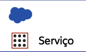
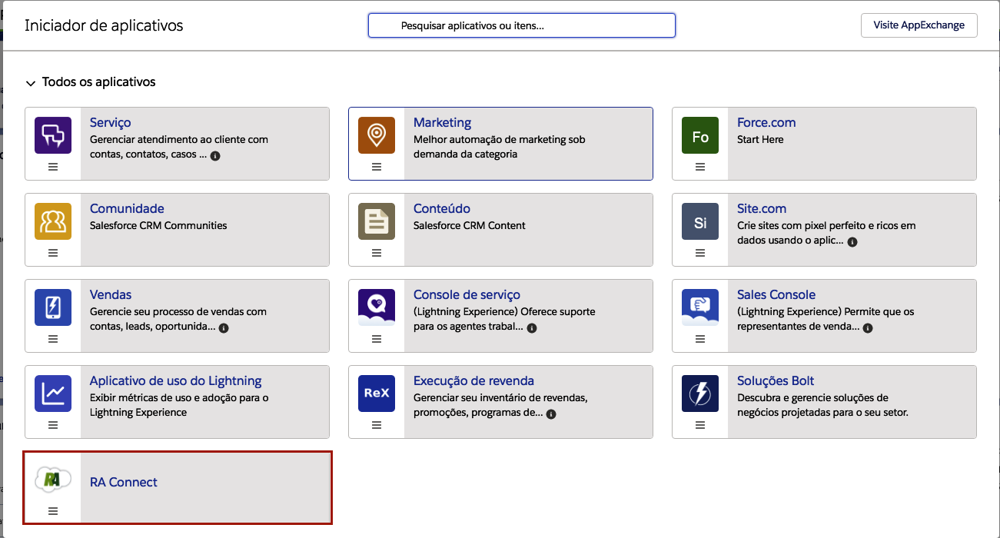

#################
Cadastro de Nova Conexão
#################

Para registrar uma nova conexão, abra seu iniciador de aplicativos e selecione o aplicativo do RA Connect, como nas figuras a seguir:

    
    Iniciador de aplicativos.

    
    Aplicativo do RA Connect.

Agora vá na aba do **Conexões do RA** e clique em novo ou clique na aba e clique em Criar Conexão do RA, como na figura a seguir:

.. figure:: img/criarConexao.png
    :alt: Solidity logo
    :align: center
    
    Botão Criar Conexão do RA.

Após clicar em nova conexão aparece a seguinte tela:

.. figure:: img/cadastroConexao.png
    :alt: Solidity logo
    :align: center
    
    Cadastro de uma nova conexão do RA Connect.

Definições dos campos:

*   **Intervalo de Sincronização (em Minutos)**: marca a periodicidade de atualização da conexão (em minutos). 

*   **Ativo**: apenas conexões ativas serão atualizadas de acordo do intervalo de sincronização. 

**Nome exclusivo da Fila**: será a fila atribuída como proprietária às reclamações captadas pela conexão (caso não tenha uma fila que não suporte o objeto **CASO** veja como criar aqui: :doc:`/Funcional/fila`).

.. Hint:: Fila atribui registros a equipes que compartilham atividades. Para mais informações acesse o seguinte link: https://help.salesforce.com/articleView?id=setting_up_queues.htm

*   **Usuário do RA API**: usuário da **API da Reclame Aqui**, "RA API". 

*   **Senha do RA API**: senha da **API da Reclame Aqui**, "RA API". 

.. Hint:: Caso não tenha **Usuário e Senha**, será necessário a aquisição do mesmo através do site: https://parasuaempresa.reclameaqui.com.br/ra-api.