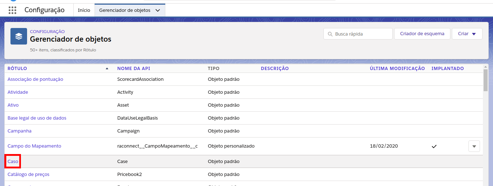
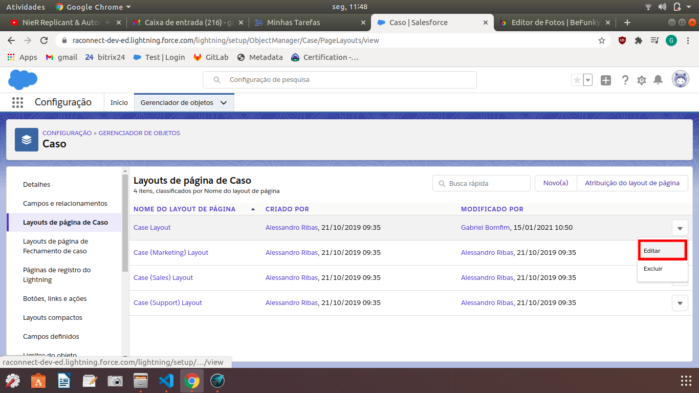
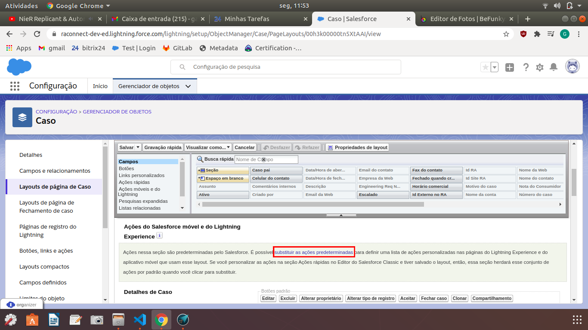
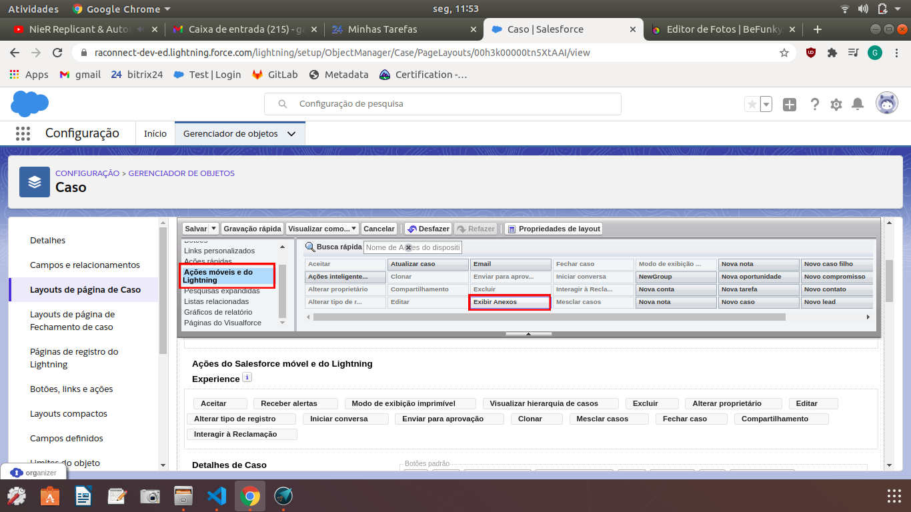
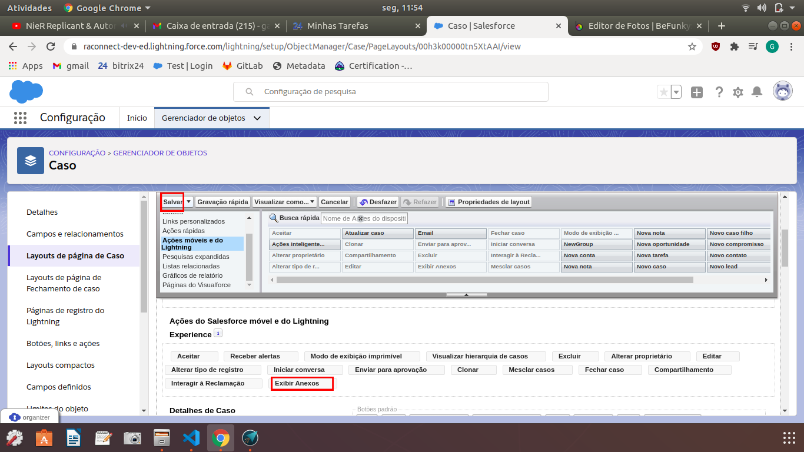
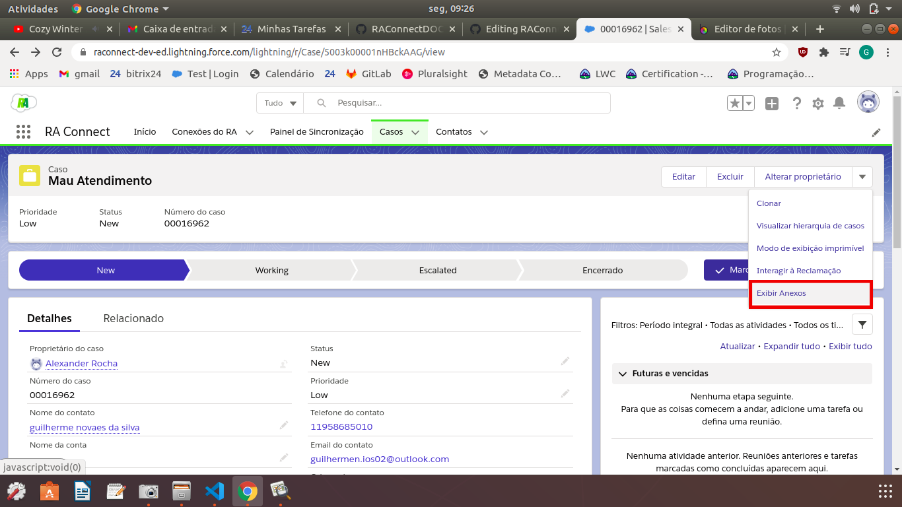
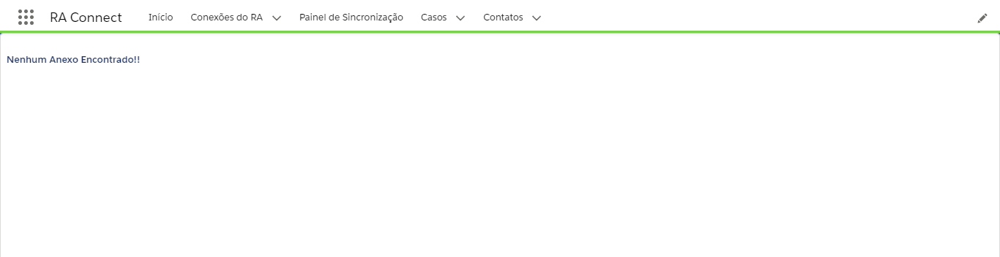
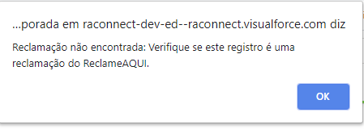

#################
Exibir Anexos da Reclamação
#################

Para habilitar a funcionalidade do botão "Exibir Anexos", é necessário primeiro adicioná-lo ao Layout do Caso.
Em Configuração, vá em Gerenciador de objetos e procure por Caso, como na figura:

    
    Clicar em Caso

Depois, clicar em "Layouts de página de Caso", escolher o Layout desejado e clicar em Editar, como na figura:

    
    Clicar em Editar

Na tela de edição de Layout, na seção "Ações do Salesforce móvel e do Lightning Experience", clicar em "substituir as ações predeterminadas":

    
    É possível que este passo não seja necessário!

Depois, procurar por "Ações móveis e do Lightning" e arrastar "Exibir Anexos" para a seção "Ações do Salesforce móvel e do Lightning Experience", como nas figuras abaixo:

    

    
    Após estes passos, é só clicar em Salvar
    

Para ver os anexos pertencentes a uma reclamação, acesse a página "Casos" e encontre o Caso referente à reclamação. Após abrir a página do Caso, clique em expandir os botões de ação, aparecendo a opção Exibir Anexos como na figura a seguir:

    
    Botão Exibir Anexo destacado

Se a reclamação possuir anexos, estes serão mostrados na tela:

.. figure:: img/anexosExibidos.png
    :alt: Solidity logo
    :align: center
    
    Poderá então fazer download do anexo desejado apenas clicando nele

.. Hint:: Quanto mais anexos pertencentes à reclamação, mais tempo será necessário para buscá-los do sistema.
    

Se a reclamação não possuir nenhum anexo, a mensagem dizendo "Nenhum Anexo Encontrado!!" irá aparecer no título da página.

    
    Apenas para Reclamações sem anexo
    

Se o Caso não possuir reclamação no banco de dados, um Pop-up notificará o usuário dizendo que nenhuma reclamação foi encontrada:

    
    Apenas para Casos sem reclamações