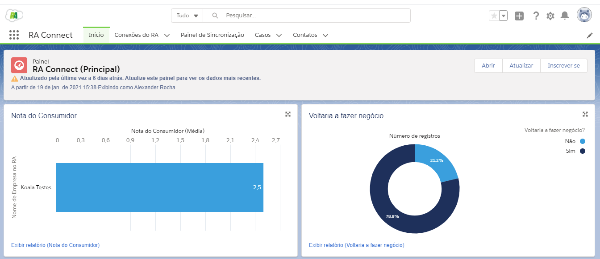
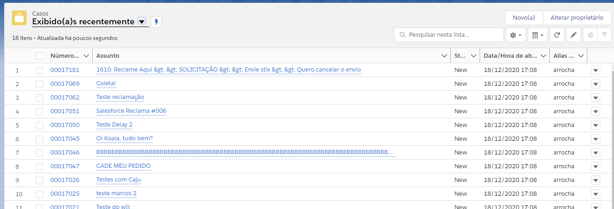
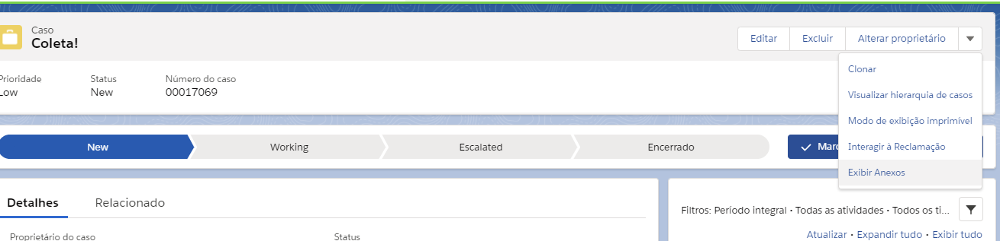
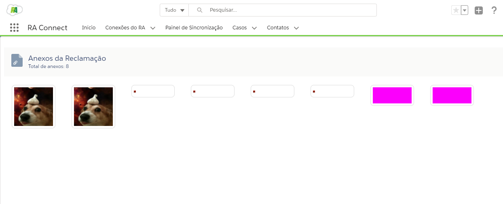

#################
Exibir Anexos
#################

Para ver os anexos adicionados, abra a pagina chamada "Casos", encontre sua reclamação via pesquisa ou na própria tabela, e então abra a mesma, clique na seta ao lado para abrir o menu, e clique em "exibir anexos" como nas figuras a seguir:

    
    Página Inicial.

    
    Página de Casos.

    
    Exibir Anexos do caso.

Após entrar na página de "Exibir Anexos" vai depender do caso possuir anexos ou não, caso o mesmo não possua nenhum anexo, assim que abrir, o titulo dizendo "Nenhum Anexo Encontrado!!" irá aparecer no título da página.

.. figure:: img/NenhumAnexoEncontrado.png
    :alt: Solidity logo
    :align: center
    
    Caso não possui nenhum anexo cadastrado no sistema!!.

Em Alguns casos, pode ocorrer na reclamação não existir mais no banco de dados, caso isso ocorra, um Pop-up onde irá dizer que o mesmo não foi encontrado no sistema.

.. figure:: img/pop-up.png
    :alt: Solidity logo
    :align: center
    
    Pop-up de inexistente no sistema!!.

Ao entrar na página, caso o sistema identifique que o caso expecifico possui anexo, o mesmo irá carregar fotos, gifs e pdfs dos mesmos, podendo ser clicados para baixa-los, alem de mostrar em seu titulo, quantos anexos foram encontrados.

    
    Pop-up de inexistente no sistema!!.

.. Hint:: Dependendo da quantidade de anexos que esse caso possua, mais deva demorar para a tela carregar pela grande quantidade de buscas ao sistema.