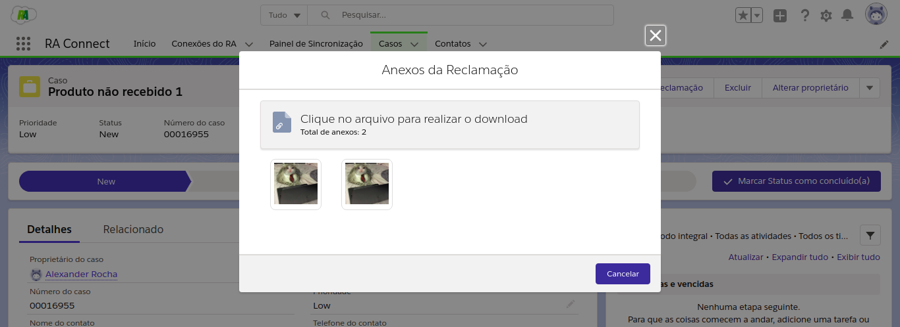

#################
Exibir Anexos da Reclamação
#################

Para ver os anexos pertencentes a uma reclamação, acesse a página "Casos" e encontre o Caso referente à reclamação. Após abrir a página do Caso, clique em expandir os botões de ação, aparecendo a opção Exibir Anexos como na figura a seguir:

.. figure:: img/botaoExibirAnexos.png
    :alt: Solidity logo
    :align: center
    
    Botão Exibir Anexo destacado

Se a reclamação possuir anexos, estes serão mostrados na tela:

    
    Poderá então fazer download do anexo desejado apenas clicando nele.

.. Hint:: Quanto mais anexos pertencentes à reclamação, mais tempo será necessário para buscá-los do sistema.
    
Se a reclamação não possuir nenhum anexo, a mensagem dizendo "Nenhum Anexo Encontrado!!" irá aparecer no título da página.

.. figure:: img/NenhumAnexoEncontrado.png
    :alt: Solidity logo
    :align: center
    
    Apenas para Reclamações sem anexo
    
Se o Caso não possuir reclamação no banco de dados, um Pop-up notificará o usuário dizendo que nenhuma reclamação foi encontrada:

.. figure:: img/pop-up.png
    :alt: Solidity logo
    :align: center
    
    Apenas para Casos sem reclamações