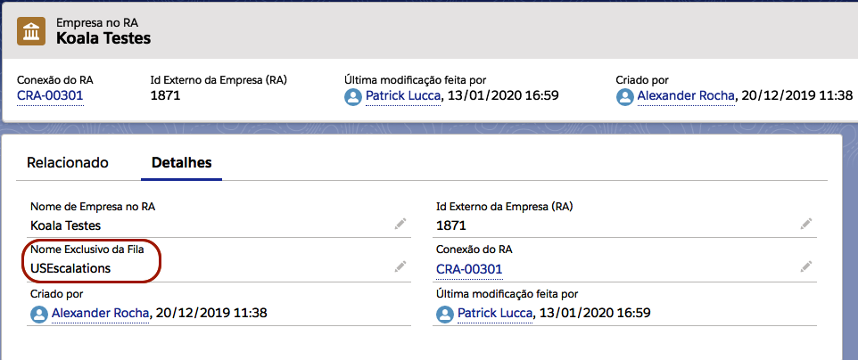

#################
Filas
#################

Neste tópico estaremos falando sobre filas de usuários no Salesforce e como utilizamos essa funcionalidade na nossa aplicação.
Antes de registrar uma conexão é necessário ter um fila com suporte ao objeto **CASO**, caso não tenha uma fila com suporte a esse objeto, mostraremos como criar a seguir.

Para criar uma **Fila**, vá até às configurações através da engrenagem no canto superior direito, como na figura a seguir:

.. figure:: img/configuracao.png
    :alt: Solidity logo
    :align: center
    
    Acessando **Configurações** da organização.

A seguir digite na barra de busca rápida **"Filas"** e clique nele, como na figura a seguir:

    
    Pesquisa por **Filas**, no campo de busca rápida.

Agora clique no botão **Novo** e a seguir terá uma explicação dos campos da Fila:

    
    Botão para criar uma nova Fila.

A seguir terá um exemplo de criação de uma fila para a nossa aplicação.

.. figure:: img/exemploFila1.png
    :alt: Solidity logo
    :align: center
    
    Preenchimento do nome da fila e o endereço de email.

    
    Adicionando os objetos suportados.

    
    Membros responsáveis pela fila.

+--------------------------+---------------------------------------------------------------------------+
|           Campo          |                                Descrição                                  |
+==========================+===========================================================================+
| Rótulo                   | Será o nome da fila, podendo conter espaço e caracteres especiais.        |
+--------------------------+---------------------------------------------------------------------------+
| Nome da fila             | Será o nome exclusivo da fila, será o nome que será atribuído para |br|   |
|                          | o campo "Nome exclusivo da fila", na conexão ou na empresa.               |
+--------------------------+---------------------------------------------------------------------------+
| Email da fila            | Será o e-mail que receberá as notificações quando tiver algum objeto |br| |
|                          | novo na fila, caso o campo "Enviar email aos membros" esteja marcado.    |
+--------------------------+---------------------------------------------------------------------------+
| Enviar email aos membros | Habilita ou desabilita o envio de notificações por e-mail.                |
+--------------------------+---------------------------------------------------------------------------+
| Objetos disponíveis      | Será os objetos em que poderá vincular essa fila, no caso da nossa |br|   |
|                          | aplicação será necessário selecionar o objeto **CASO**.                   |
+--------------------------+---------------------------------------------------------------------------+
| Membros da fila          | Representa os membros que serão responsável pela fila em questão.         |
+--------------------------+---------------------------------------------------------------------------+

Fila Conexão
-----------------------

    
    Nome da fila padrão da conexão.

O campo "Nome Exclusivo da Fila", na conexão é um campo obrigatório, a fila cadastrada neste campo será atribuída como proprietária das reclamações geradas pela integração, caso a empresa não tenha uma fila registrada.

Fila Empresa
-----------------------

    
    Nome da fila que será proprietária das reclamações dessa empresa.

O campo "Nome Exclusivo da Fila", na empresa **não é** um campo obrigatório, a fila cadastrada neste campo será atribuída como proprietária das reclamações geradas dessa empresa.

Regras da Fila
-----------------------

A fila cadastrada na conexão será a proprietária dos **casos** integrados com o Salesforce, caso não haja uma **fila** cadastrada na **Empresa do RA**, se houver uma **fila** cadastrada na **Empresa do RA**, essa **fila** será a proprietária do **caso**.
Se tivermos várias **Empresas do RA** associadas à mesma **conexão**, cada empresa poderá ter sua própria fila, caso contrário será atribuído com a fila padrão da conexão.

.. |br| raw:: html

     