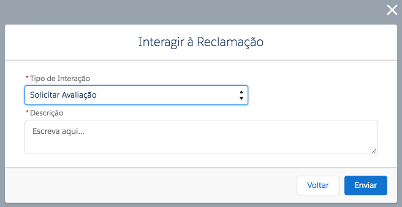

#################
Interações com a reclamação do **Reclame AQUI**
#################

Nessa seção será demosntrado as possíveis interações com as reclamações da **Reclame AQUI**.
Para interagir com alguma reclamação, será necessário ir no caso relacionado com a reclamação em questão e clicar em expandir os botões de ação, aprecendo a opção **Interagir à Reclamação** como na figura a seguir.

    
    Botão Interagir à Reclamação

.. Hint:: Só é possível interagir à casos criados através da nossa aplicação, caso seja um caso não vinculado com nossa aplicação ou que tenha perdido o vinculo com a **Reclame AQUI** aparecerá uma mensagem de erro. 

Responder Publicamente
-----------------------

Envia uma mensagem pública ao consumidor.

    
    Enviando mensagem publicamente.

Definições dos campos:

**Descrição**: será a mensagem enviada para o consumidor.

Responder por Email
-----------------------

Envia uma mensagem privada via e-mail ao consumidor.

.. figure:: img/mensagemPrivada.png
    :alt: Solidity logo
    :align: center
    
    Enviando mensagem privada por e-mail.

Definições dos campos:

**E-mail**: será o endereço de e-mail do consumidor que receberá a mensagem.

**Descrição**: será a mensagem enviada para o consumidor.

Solicitar Avaliação
-----------------------

Solicita ao consumidor que avalie a reclamação, o pedido será enviado por e-mail de registro do consumidor. 

    
    Solicitando uma avaliação da reclamação em questão.

Definições dos campos:

**Descrição**: será a mensagem enviada para o consumidor.

Solicitar Moderação
-----------------------

Solicita uma revisão da reclamação para a equipe de qualidade da **Reclame AQUI**.

    
    Solicitando uma moderação da reclamação em questão.

Definições dos campos:

**Motivo**: motivo para a revisão da reclamação.

**Descrição**: será a mensagem enviada para a equipe de qualidade da **Reclame AQUI**.