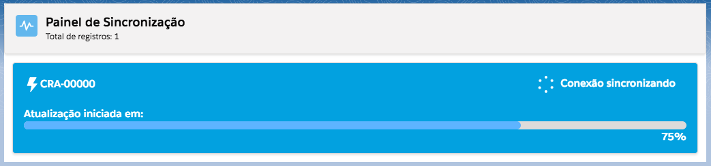
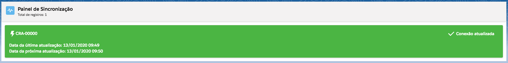
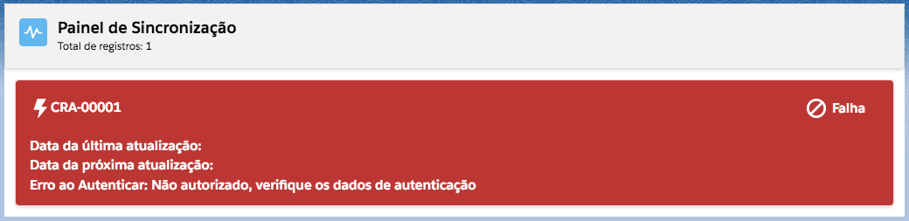
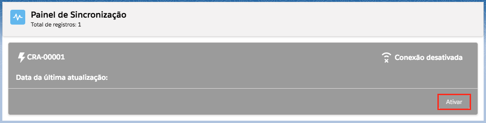
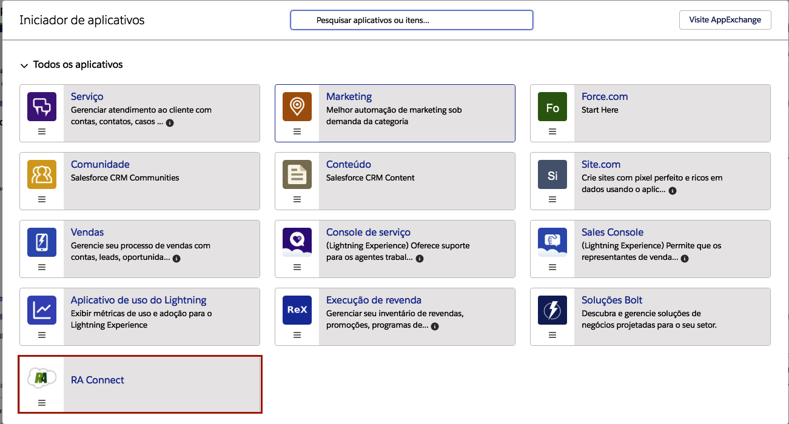
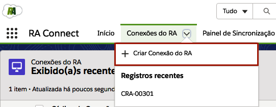
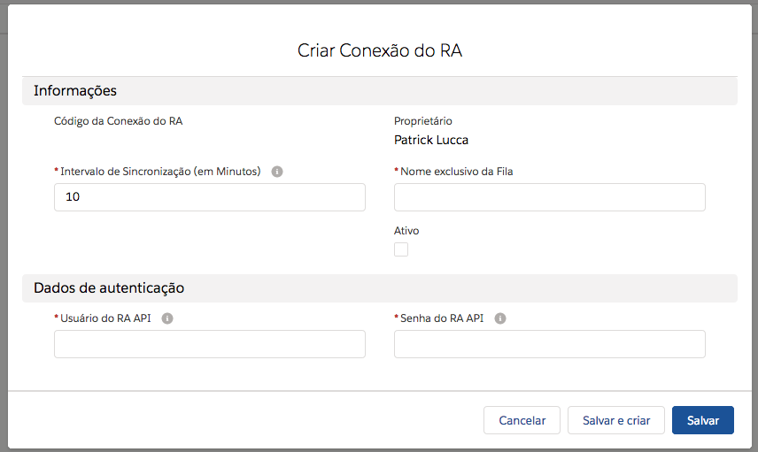

#################
Painel de Sincronização
#################

No painel de sincronização, mostrará o status das suas conexões. 
Assim que uma nova conexão for criada, a mesma irá carregar todas as reclamações vinculada a mesma. Essas reclamações serão convertidos em **CASOS** do Salesforce, as interações daquela reclamação serão convertidos em **COMENTARIOS DO CASO** e o consumidor que criou a reclamação vira o **CONTATO** do Salesforce vinculado à esse **CASO**. 

.. Hint:: Para saber mais sobre a conversão das reclamações para objetos do Salesforce veja em: `Relação de Objetos`_

Nesse painel mostra os seguintes status que uma conexão pode ter, como **Conexão Sincronizando**, **Conexão Atualizada**, **Falha**, **Conexão Desativada**. As figuras a seguir demosntram os status comentados.

**Conexão Sincronizando**
-----------------------

    
    Status da conexão quando estiver atualizando.

**Conexão Atualizada**
-----------------------

    
    Status da conexão quando estiver atualizada.

**Falha**
-----------------------

    
    Status da conexão quando acontece algum erro durante a atualização.

**Conexão Desativada**
-----------------------

    
    Status da conexão quando ela estiver desativada.

.. _Relação de Objetos : /Funcional/relacao_objetos.html

    
    Aplicativo do RA Connect.

Agora vá na aba do **Conexões do RA** e clique em novo ou clique na aba e clique em Criar Conexão do RA, como na figura a seguir:

    
    Botão Criar Conexão do RA.

Após clicar em nova conexão aparece a seguinte tela:

    
    Cadastro de uma nova conexão do RA Connect.

Definições dos campos:

**Intervalo de Sincronização (em Minutos)**: marca a periodicidade de atualização da conexão (em minutos). 

**Ativo**: apenas conexões ativas serão atualizadas de acordo do intervalo de sincronização. 

**Nome exclusivo da Fila**: será a fila atribuída como proprietária às reclamações captadas pela conexão.

.. Hint:: Fila atribui registros a equipes que compartilham atividades. Para mais informações acesse o seguinte link: https://help.salesforce.com/articleView?id=setting_up_queues.htm

**Usuário do RA API**: usuário da **API da Reclame Aqui**, "RA API". 

**Senha do RA API**: senha da **API da Reclame Aqui**, "RA API". 

.. Hint:: Caso não tenha **Usuário e Senha**, será necessário a aquisição do mesmo através do site: https://parasuaempresa.reclameaqui.com.br/ra-api.