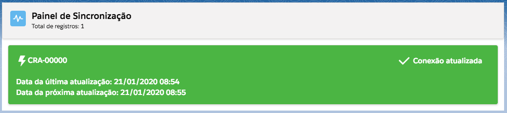

#################
Painel de Sincronização
#################

No painel de sincronização, mostrará o status das suas conexões. 
Assim que uma nova conexão for criada, a mesma irá carregar todas as reclamações (criadas no site da Reclame Aqui) vinculada a mesma. Essas reclamações serão convertidos em **CASOS** do Salesforce, as interações daquela reclamação serão convertidos em **COMENTARIOS DO CASO** e o consumidor que criou a reclamação vira o **CONTATO** do Salesforce vinculado à esse **CASO**. 

.. Hint:: Para saber mais sobre a conversão das reclamações para objetos do Salesforce veja em: :doc:`/Funcional/relacao_objetos`.

Nesse painel mostra os seguintes status que uma conexão pode ter, como **Conexão Sincronizando**, **Conexão Atualizada**, **Falha**, **Conexão Desativada**. As figuras a seguir demosntram os status comentados.

Conexão Sincronizando
-----------------------

.. figure:: img/conexaoSincronizando.png
    :alt: Solidity logo
    :align: center
    
    Status da conexão quando estiver atualizando.

Nesse status, a conexão estará baixando e convertendo as reclamações para o salesforce.

Conexão Atualizada
-----------------------

    
    Status da conexão quando estiver atualizada.

Nesse status, a conexão mostrará quando foi feito a última atualização e quando será feito a próxima.

Falha
-----------------------

.. figure:: img/conexaoError.png
    :alt: Solidity logo
    :align: center
    
    Status da conexão quando acontece algum erro durante a atualização.

Nesse status, a conexão mostrará quando foi feito a última atualização e quando será feito a próxima e o erro que aconteceu na última vez que tentou atualizar as reclamações.

Conexão Desativada
-----------------------

.. figure:: img/conexaoInativa.png
    :alt: Solidity logo
    :align: center
    
    Status da conexão quando ela estiver desativada.

Nesse status, mostra a última vez que a conexão foi atualizada e contém um botão para ativa-lá, caso necessário.

Sincronização Desativada
-----------------------

    
    Sincronização desativada.

Caso a sincronização seja desativada, é possível ativá-la clicando no botão **Ativar Sincronização**, para isso o usuário deverá ter a permissão para criar um *trabalho agendado* na organização.
