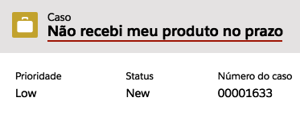
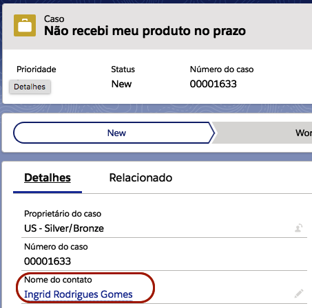

#################
Relação de Objetos
#################

Neste tópico estaremos falando sobre o relacionamento entre as reclamações do **ReclameAQUI** com os objetos que o RA Connect utiliza no Salesforce.

Reclamação
-----------------------

    
    Caso criado a partir de uma reclamação.

As reclamações baixadas pela conexão serão transformadas em **casos** no Salesforce, dados da reclamação como o título, interações e quem abriu a reclamação serão transformados em dados do **caso** criado.

Interação
-----------------------

    
    Comentário do caso, criado a partir de uma interação da reclamação.

As interações relacionada àquela reclamação serão registradas como **comentário do caso**.

Consumidor
-----------------------

    
    Contato vinculado ao caso.

Esse **contato** é o representante do consumidor dentro do Salesforce.

    
    Contato que representa o consumidor que abriu a reclamação.	

Os dados do consumidor abastecerá os dados do **contato**.

.. Hint:: Caso tenha um contato já existente do consumidor no Salesforce (a base de identificação é o campo Email), será atribuída à esse contato todos as reclamações relacionadas ao consumidor, caso contrário será criado um novo contato e as reclamações serão vinculadas ao mesmo.