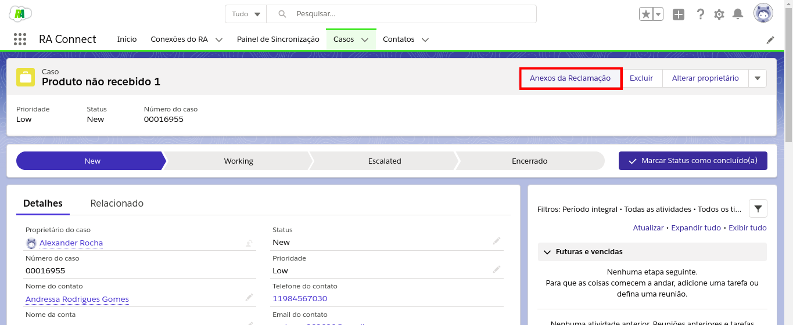
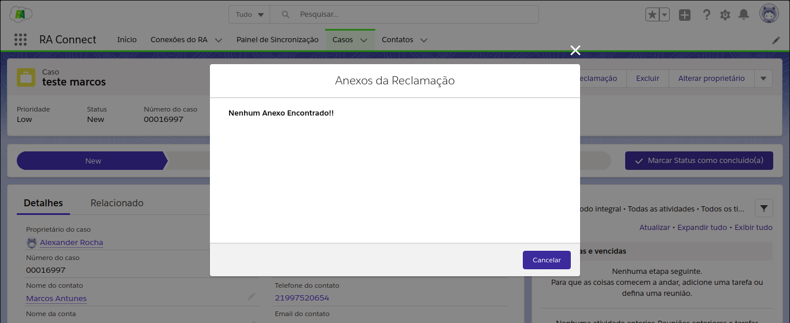
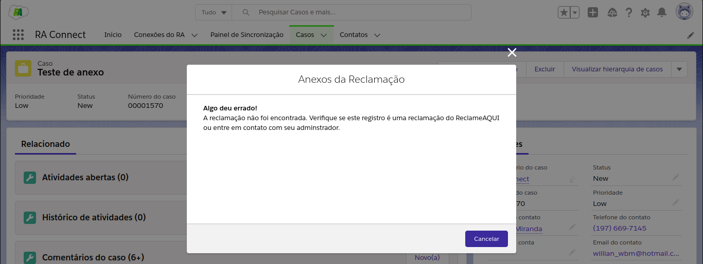

Visualizando Anexos
-----------------------

Para ver os anexos pertencentes a uma reclamação, acesse a página **Casos** e encontre o Caso referente à reclamação. Depois é só clicar no botão **Anexos da Reclamação**:

    
    Botão Anexos da Reclamação (Lightning) destacado

Se a reclamação possuir anexos, estes serão mostrados na tela:

.. figure:: img/anexosExibidos.png
    :alt: Solidity logo
    :align: center
    
    Poderá então fazer download do anexo desejado apenas clicando nele

.. Hint:: Quanto mais anexos pertencentes à reclamação, mais tempo será necessário para buscá-los do sistema.
    

Se a reclamação não possuir nenhum anexo, a mensagem dizendo "Nenhum Anexo Encontrado!!" irá aparecer no título da página.

    
    Apenas para Reclamações sem anexo
    

Se o Caso não possuir reclamação no banco de dados, uma mensagem notificará o usuário dizendo que nenhuma reclamação foi encontrada:

    
    Apenas para Casos sem reclamações