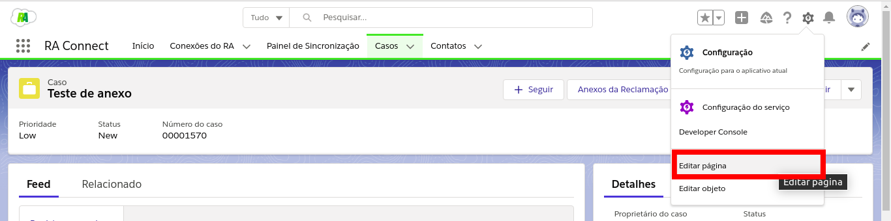
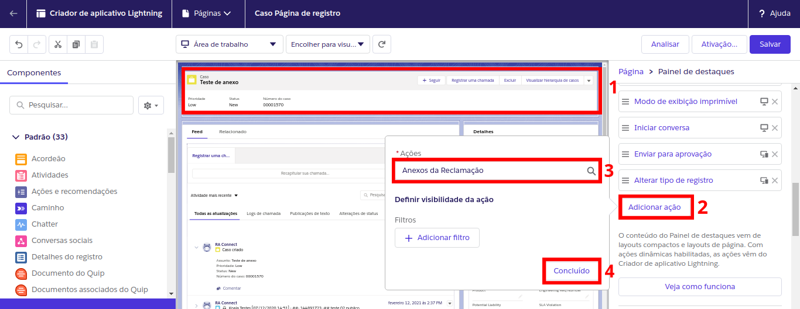
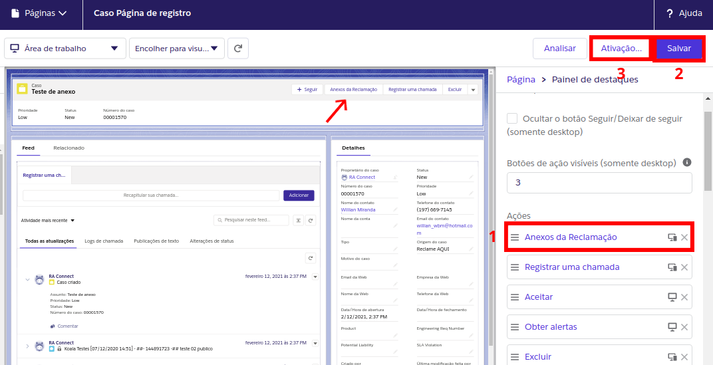
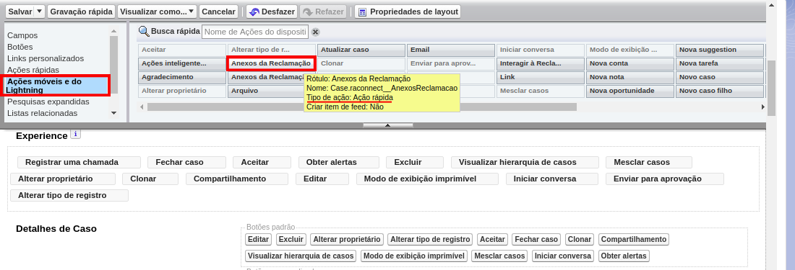
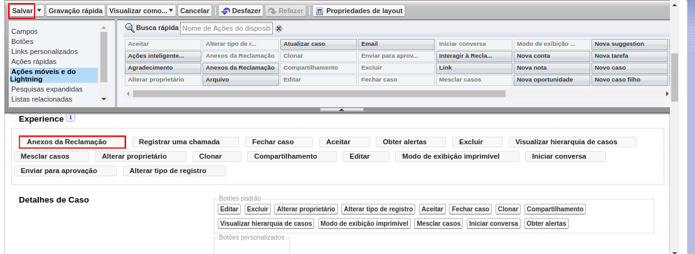

#################
Exibir Anexos da Reclamação
#################

Há dois botões para a funcionalidade de exibir os anexos: um para a experiência Classic e outro para Lightning.

Adicionando o botão no Classic
-----------------------

Em **Configuração**, vá em **Gerenciador de objetos** e procure por **Caso**, como na figura:

.. figure:: img/clicarCaso.png
    :alt: Solidity logo
    :align: center
    
    Clicar em Caso

Depois, clique em **Layouts de página de Caso**, escolha o Layout desejado e clicque em **Editar**, como na figura:

.. figure:: img/clicarLayoutCaso.png
    :alt: Solidity logo
    :align: center
    
    Clicar em Editar

Clique em **Botões** e arraste o botão **Anexos da Reclamação** para a seção de botões personalizados:

.. figure:: img/casoLayoutEditar1.png
    :alt: Solidity logo
    :align: center

.. figure:: img/casoLayoutEditar2.png
    :alt: Solidity logo
    :align: center

    Agora é só clicar em Salvar!

Adicionando o botão no Lightning (Com Chatter)
-----------------------

**Se a sua organização utiliza Chatter, siga estes passos:**

Acesse a página de qualquer Caso em sua organização e clique em **Editar Página**:

Clique na **seção** da página onde o botão ficará (1), depois em **Adicionar ação** (2).
Pesquise por **Anexos da Reclamação** (3) e clique em **Concluído** (4):

Agora arraste a ação **Anexos da Reclamação** onde desejar (1), salve (2) e clique em Ativação... (3):

    Agora é só seguir o processo de Ativação!

Adicionando o botão no Lightning (Sem Chatter)
-----------------------

**Se a sua organização não utiliza Chatter, siga estes passos:**

Em **Configuração**, vá em **Gerenciador de objetos** e procure por **Caso**, como na figura:

.. figure:: img/clicarCaso.png
    :alt: Solidity logo
    :align: center
    
    Clicar em Caso

Depois, clique em **Layouts de página de Caso**, escolha o Layout desejado e clicque em **Editar**, como na figura:

.. figure:: img/clicarLayoutCaso.png
    :alt: Solidity logo
    :align: center
    
    Clicar em Editar

Clique em **Ações móveis e do Lightning** e arraste a Ação rápida **Anexos da Reclamação** para a seção **Ações do Salesforce móvel e do Lightning Experience**:

    Agora é só clicar em Salvar!