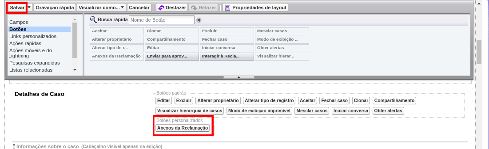

#################
Exibir Anexos da Reclamação
#################

Há dois botões para a funcionalidade de exibir os anexos: um para a experiência Classic (que também funciona no Lightning) e outro apenas para Lightning.

.. Obs:: O botão para a experiência do Lightning só funciona se o Chatter estiver desativado.

Para habilitar a funcionalidade dos botões "Anexos da Reclamação", é necessário primeiro adicioná-los ao Layout do Caso.
Em Configuração, vá em Gerenciador de objetos e procure por Caso, como na figura:

.. figure:: img/clicarCaso.png
    :alt: Solidity logo
    :align: center
    
    Clicar em Caso

Depois, clicar em "Layouts de página de Caso", escolher o Layout desejado e clicar em Editar, como na figura:

.. figure:: img/clicarLayoutCaso.png
    :alt: Solidity logo
    :align: center
    
    Clicar em Editar

Primeiro vamos adicionar o botão para a experiência do Lightning:

Na tela de edição de Layout, na seção "Ações do Salesforce móvel e do Lightning Experience", clicar em "substituir as ações predeterminadas":

.. figure:: img/casoLayoutEditar1.png
    :alt: Solidity logo
    :align: center
    
    É possível que este passo não seja necessário!

Depois, procurar por "Ações móveis e do Lightning" e arrastar a Ação Rápida "Anexos da Reclamação" para a seção "Ações do Salesforce móvel e do Lightning Experience", como nas figuras abaixo:

    
.. figure:: img/casoLayoutEditar3.png
    :alt: Solidity logo
    :align: center
    
    Este é o botão que funciona apenas no Lightning e com o Chatter desativado!
    

.. Obs:: Se o Chatter não puder ser desativado, arraste o outro elemento "Anexos da Reclamação" ao invés deste da foto.

Agora, adicionaremos o botão para a experiência do Classic:

.. figure:: img/casoLayoutEditar4.png
    :alt: Solidity logo
    :align: center

.. figure:: img/casoLayoutEditar5.png
    :alt: Solidity logo
    :align: center

    Agora é só clicar em Salvar!

Para ver os anexos pertencentes a uma reclamação, acesse a página "Casos" e encontre o Caso referente à reclamação. Após abrir a página do Caso, clique no botão Anexos da Reclamação:

    
    Botão Anexos da Reclamação (Lightning) destacado

Se a reclamação possuir anexos, estes serão mostrados na tela:

.. figure:: img/anexosExibidos.png
    :alt: Solidity logo
    :align: center
    
    Poderá então fazer download do anexo desejado apenas clicando nele

.. Hint:: Quanto mais anexos pertencentes à reclamação, mais tempo será necessário para buscá-los do sistema.
    

Se a reclamação não possuir nenhum anexo, a mensagem dizendo "Nenhum Anexo Encontrado!!" irá aparecer no título da página.

    
    Apenas para Reclamações sem anexo
    

Se o Caso não possuir reclamação no banco de dados, uma mensagem notificará o usuário dizendo que nenhuma reclamação foi encontrada:

    
    Apenas para Casos sem reclamações