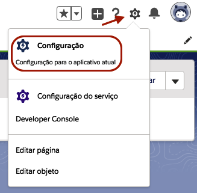
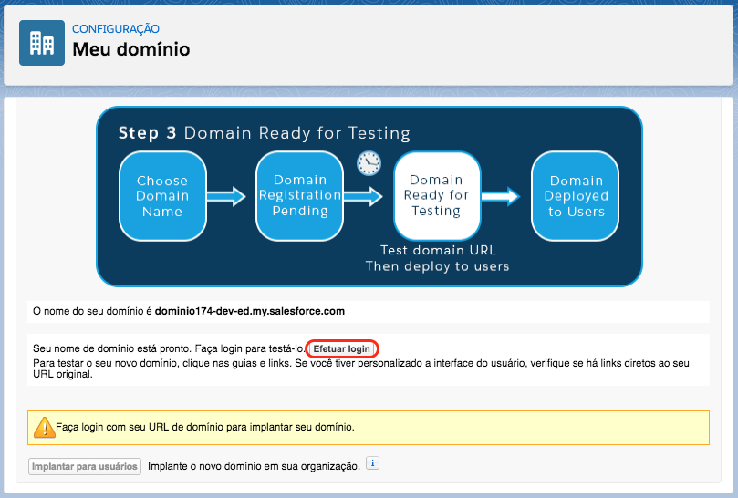
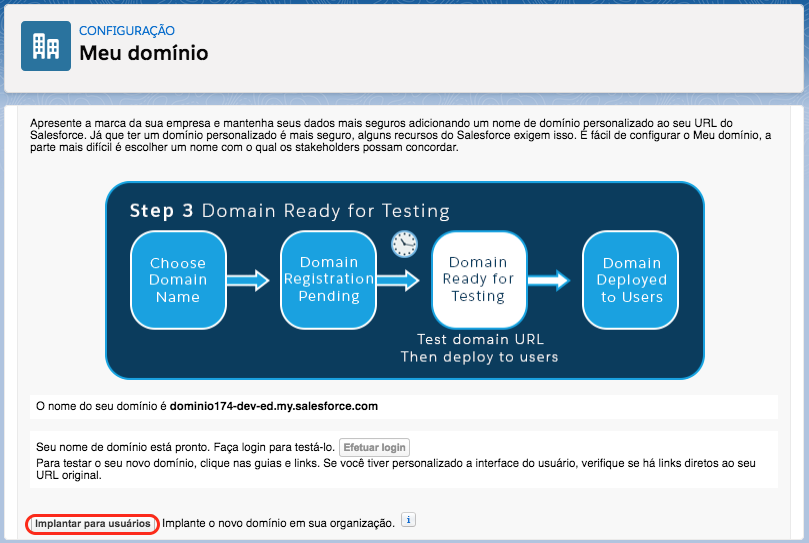
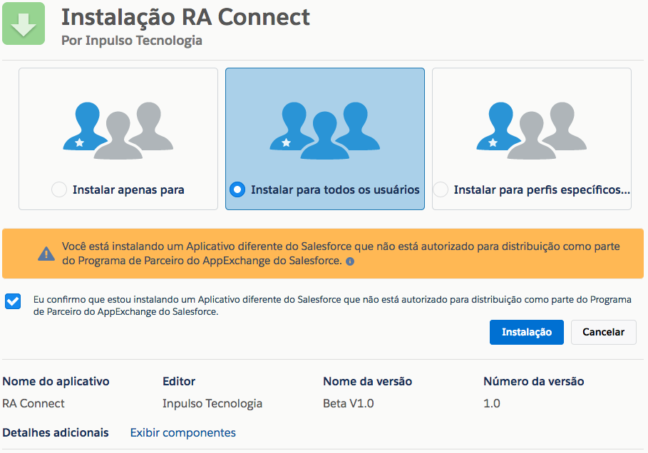
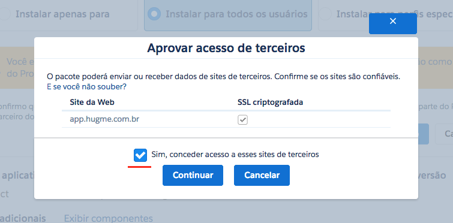
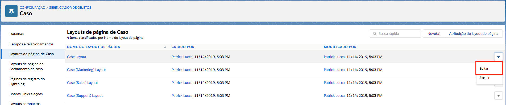
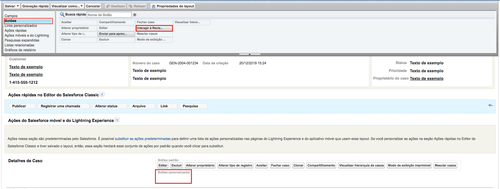
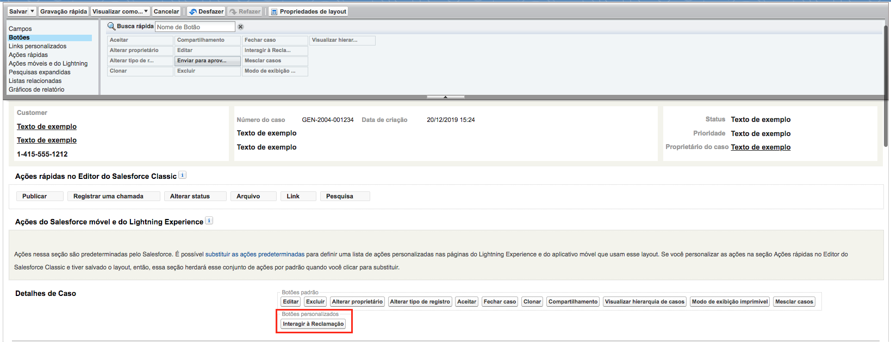

Registro de Domínio para a Organização
-----------------------

Para que o pacote possa ser baixado primariamente o usuário deve possuir uma organização no SalesForce que possua o domínio cadastrado. Para cadastrar um domínio, vá até às configurações através a engrenagem no canto superior direito, como na figura a seguir: 

    
    Acessando **Configurações** da organização.

A seguir digite na barra de busca rápida **Meu domínio** e clique nele, como na figura a seguir:

.. figure:: img/dominio1.png
    :alt: Solidity logo
    :align: center
    
    Barra de pesquisa das configurações

Caso não tenha domínio cadastrado, deve-se escolher um nome para o domínio e verificar a validade do mesmo.

.. figure:: img/dominio2.png
    :alt: Solidity logo
    :align: center
    
    Registro de domínio

Após a validação confirmada, registrar o domínio do mesmo. Após o registro concluído, o SalesForce pedirá para que logue novamente. 

Após logar, vá para a tela do **Meu domínio** novamente e clique em **Efetuar login**.

Efetuado login, clique em **Implantar para usuários**.

    
Tendo realizado estas ações, já com o domínio registrado, poderá seguir para a instalação do pacote.

Instalação do Pacote Gerenciado
-----------------------

O download do pacote para a sua organização deve ser realizado através do link abaixo:
         
         https://login.salesforce.com/packaging/installPackage.apexp?p0=04t3k000001ytPh
         
O login na sua organização será requerido, e após a realização será automaticamente redirecionado para a tela de download do pacote, onde será necessário marcar as opções apresentadas abaixo:

    
    Seleção de instalação para todos os perfis

Logo após a confirmação uma notificação aparecerá, sendo necessária a confirmação do seguinte item:
   

    
    Garantia de acesso
    
Depois da confirmação das opções anteriores, o download começará normalmente, demorando entre 1 a 3 minutos. Após a confirmação do encerramento do download a apliacação já estará visível para o cliente através dos aplicativos do SalesForce.

.. figure:: img/painelAplicacao.png
    :alt: Solidity logo
    :align: center
    
    Painel de aplicações
        

Adicionando botão de Interação da aplicação
-----------------------

Na aplicação do RA Connect é possível interagir com a reclamação traziada do **Reclama Aqui**, todas as reclamações viram **Casos** no Salesforce.
Para poder interagir com a reclamação será necessário adicionar um botão personalizado no layout de Caso, da preferencia da Organização.

Para isso vá até às configurações através da engrenagem no canto superior direito, como na figura a seguir:

    
    Acessando **Configurações** da organização.

Após isso, acesse o **Gerenciador de Objetos**, como na figura a seguir:

.. figure:: img/gerenciadorObjetos.png
    :alt: Solidity logo
    :align: center
    
    Acessando o **Gerenciador de Objetos** na configuração da organização.

Agora busque e clique no objeto **Caso**, como na figura a seguir:

.. figure:: img/objetoCaso.png
    :alt: Solidity logo
    :align: center
    
    Acessando o objeto **Caso** no gerenciador de objetos.

Agora, vá até o layout de página de Caso e clique em editar no layout onde irá inserir o botão. Na figura a seguir será inserido no **Case Layout**.

    
    Layouts de página de Caso

Na página de edição de layout, clique em **Botões**, nesse momento verá que tem um botão chamado **Interagir à reclamação**, arraste ele até o campo de **Botões personalizados**, como é demonstrado nas figuras a seguir.

    
    Botão personalinado "Interagir à reclamação"

    
    Botão adicionado no layout

