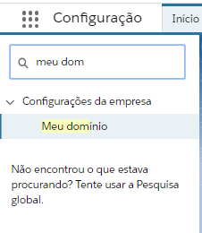
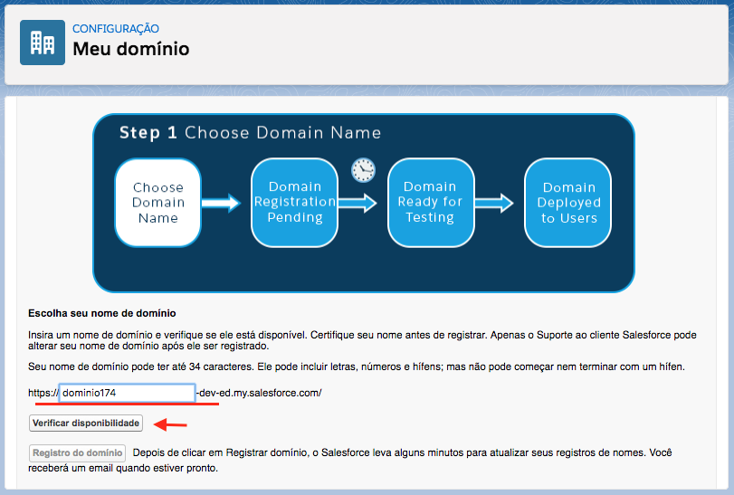
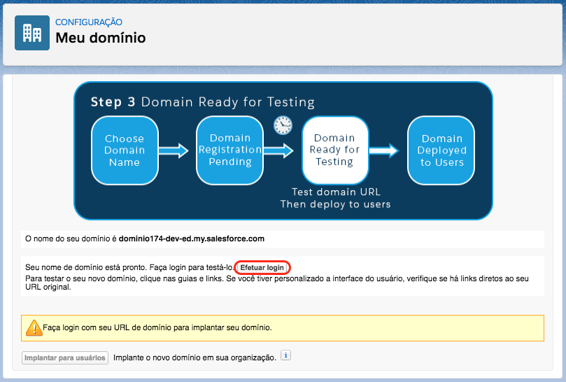
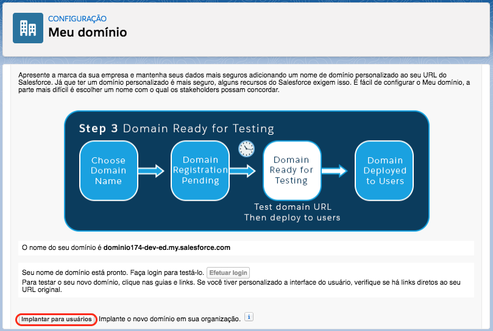
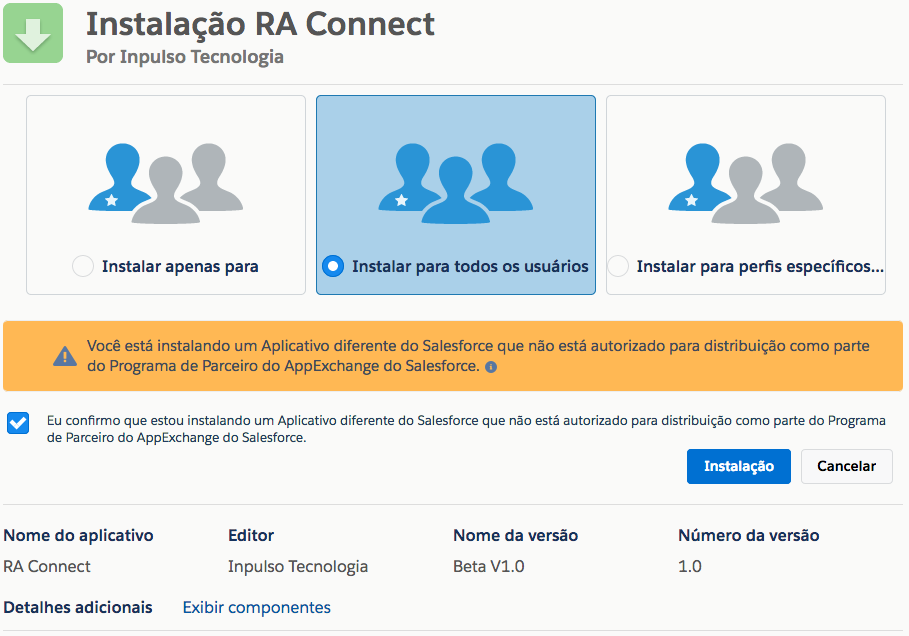
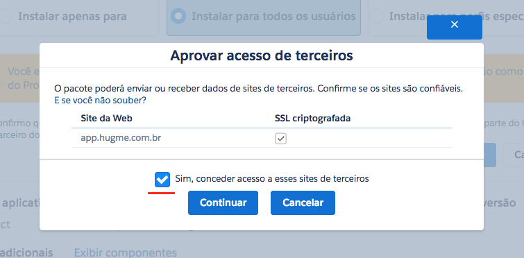
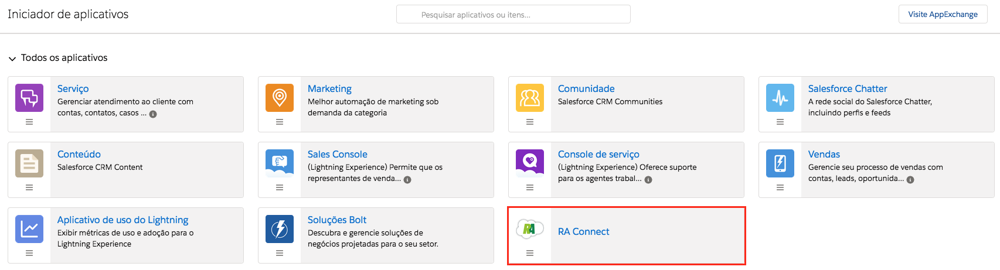
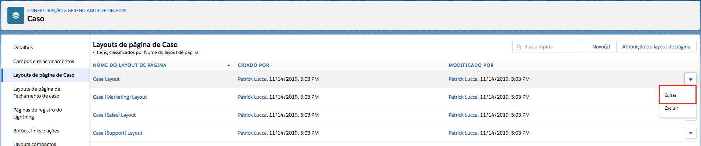
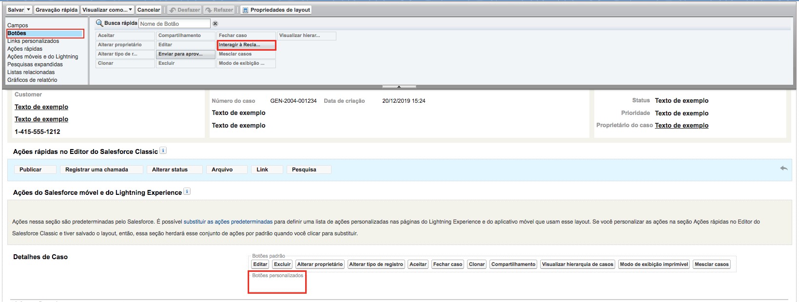
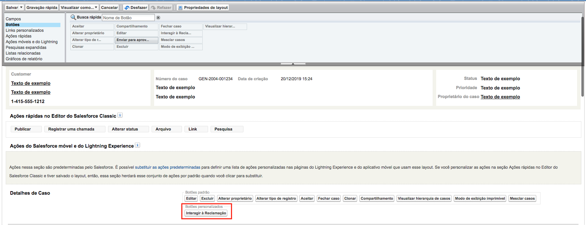

#################
Setup
#################

O objetivo deste documento é apontar os requisitos necessários e o passo-a-passo para a aplicação da funcionalidade e sua configuração em uma nova organização.

Registro de Domínio para a Organização
-----------------------

Para que o pacote possa ser baixado primariamente o usuário deve possuir uma organização no SalesForce que possua o domínio cadastrado. Para cadastrar um domínio o mesmo deve, através da barra de pesquisa acessada pelo botão Configuração, procurar por "Meu Domínio".

    
    Barra de pesquisa das configurações

Caso não tenha domínio cadastrado, deve-se escolher um nome para o domínio e verificar a validade do mesmo.

    
    Registro de domínio

Após a validação confirmada, registrar o domínio do mesmo. Após o registro concluído, o SalesForce pedirá para que logue novamente. 

Após logar, vá para a tela do "Meu domínio" novamente e clique em "Efetuar login".

Efetuado login, clique em "Implantar para usuários".

    
Tendo realizado estas ações, já com o domínio registrado, poderá seguir para a instalação do pacote.

Instalação do Pacote Gerenciado
-----------------------

O download do pacote para a sua organização deve ser realizado através do link abaixo:
         
         https://login.salesforce.com/packaging/installPackage.apexp?p0=04t3k000001ysV0
         
O login na sua organização será requerido, e após a realização será automaticamente redirecionado para a tela de download do pacote, onde será necessário marcar as opções apresentadas abaixo:

    
    Seleção de instalação para todos os perfis

Logo após a confirmação uma notificação aparecerá, sendo necessária a confirmação do seguinte item:
   

    
    Garantia de acesso
    
Depois da confirmação das opções anteriores, o download começará normalmente, demorando entre 1 a 3 minutos. Após a confirmação do encerramento do download a apliacação já estará visível para o cliente através dos aplicativos do SalesForce.

    
    Painel de aplicações
        

Adicionando botão de Interação da aplicação
-----------------------

Na aplicação do RA Connect é possível interagir com a reclamação traziada do **Reclama Aqui**, todas as reclamações viram **Casos** no Salesforce.
Para poder interagir com a reclamação será necessário adicionar um botão personalizado no layout de Caso, da preferencia da Organização.

Vá até o layout de página de Caso e clique em editar no layout onde irá inserir o botão. Na figura a seguir será inserido no **Case Layout**.

    
    Layouts de página de Caso

Na página de edição de layout, clique em **Botões**, nesse momento verá que tem botão chamado **Interagir à reclamação**, arraste ele até o campo de **Botões personalizados**, como é demonstrado nas figuras a seguir.

    
    Botão personalinado "Interagir à reclamação"

    
    Botão adicionado no layout

